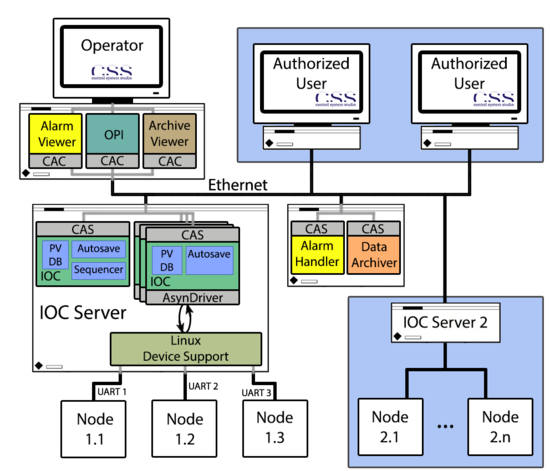

# New ISTTOK Slow Control System
## Intro

The new ISTTOK slow control system is designed to replace the former vacuum/power/slow timing system based is the EDWARDS controller.

The new system uses the [EPICS](https://epics-controls.org) framework and the [Control System Studio](http://controlsystemstudio.org), below there is a detailed description of the used software.
In the next figure is depicted the system structure.


At the present the software are installed in two IOC servers with the exception of the Control System Studio that is also used for the GUI management.

All software stored in IPFN GIT [server](https://git.ipfn.tecnico.ulisboa.pt/summary/ISTTOK.git)

## Team and responsabilities
- **Horácio Fernandes** (ISTTOK Leader)
- **Bernardo Carvalho** (Project Leader)
- **Humberto Figueiredo** (ISTTOK Session Leader)
- **Hugo Alves** (ISTTOK Session Leader, State Machine development)
- **Tiago Pereira** (dsPIC development, RS232 protocol/ Sensor Interface/ Wiring)
- **Paulo F. Carvalho** ( Epics Applications), CS-S Gui Panels)

##    System description
Presently there are two instances of EPICS IOC Server implemented.
One responsible for the Temperature Node.
And a second one, installed in a Raspberry Pi, implemented in the new control unit launched at ISTTOK for the remote control of the vacuum pumps, named Central Node.

### Temperature/Vacuum Node: Temperature Sensors and ELCO Voltage Measurement Systems
- Thermocouple Sensor
- ELCO voltage measurement
- For communication was used a fiber optic

The dsPic uses the internal ADC to read the voltage signal from the thermocouple.
To measure the ELCO's voltage it was developed two boards one to read the ELCO's voltage and another to connect the fiber optic to dsPIC.


#### Hardware Platform
- Thermocouple Sensor
- ELCO voltage measurement

1. One PC Controller

  * Intel(R) Atom(TM) CPU330 1.60GHz, Dual Core, 1 Gbyte RAM, 4 RAM
  * 4 Serial Ports
  * IP addr: 192.168.1.152 ( ISTTOK private network)
  * Scientific [Linux CERN 6](http://linux.web.cern.ch/linux/scientific6) (SLC6)
with MRG Realtime extensions
  *Linux kernel 3.2.33-rt50.66.el6rt.x86_64
  * NTP time conected to  IPFN Gps NTP/PPS server IP:10.136.236.255 and
      baco.ipfn.tecnico.ulisboa.pt (193.136.136.129)

2. Local Control
  * One or more dsPic board running an embedded firmware

 Temperature Sensors and ELCO Voltage Measurement Systems
   -For communication was used a fiber optic

The dsPic uses the internal ADC to read the voltage signal from the thermocouple.
To measure the ELCO's voltage it was developed two boards one to read the ELCO's voltage and another to connect the fiber optic to dsPIC.

#### Protocol for communication between dspics and PC
   * all bytes are readable ASCII
   * all messages all terminated with two bytes: \r\n (13 10)
   * messages have variable length
   * framing character for fields inside message is space (32)
   * individual fields inside each message have variable length
   * the last three characters before the terminator are the ASCII representation of the checksum of all other bytes, excluding the terminator
   * Messages are sent periodically (1s)

   Examples:
PIC -> PC
    `VL01_1 VL02_1 VL03_0 TE01_150.9 TE02_80.1 UP_7200 PR01_1.3e-4 CKS\r\n`

PC -> PIC
`VL01_1 CKS\r\n`

Table of word fields

| N | A |
|:------|-----|
|  VLxx_|    Valve|
|  TExx_|   Temperature|
|  UP_ |   Uptime  |
|  PRDxx_|  Wave Period |
|  PRxx_ |   Pressure |

#### Software Platform

1. EPICS V3.15.7 (instaled in `/opt/epics/base-3.15.7`)
   * IOC sources  (versioned) in `/home/codac-dev/ISTTOK/epics/iocs/ISTTOKdsPIC`
   * IOC binaries in `/opt/epics/apps/ISTTOK`
   * Init IOC script in `/etc/rc.local`
2. Modules ( (instaled in `/opt/epics/modules`)
   * ASYN [git package](https://github.com/epics-modules/asyn.git)
   * STREAM [git](https://github.com/paulscherrerinstitute/StreamDevice.git)
3. CS-Studio
   * Archive [Engine] (http://cs-studio.sourceforge.net/docbook/ch11.html)
   * Init script in `/etc/init.d/isttok-archive-engine`
   * MySQL server (user: report )
   * ArchiveConfigTool in `/home/bernardo/css/ArchiveConfigTool`

Process Value in this IOC Server:

|PV Name	|PV Type	|Archive|
|:----------|-------|---:|
|ISTTOK:temperature:Uptime	|longin|	no|
|ISTTOK:temperature:Last_Uptime	| ai	| no |
|ISTTOK:temperature:Temperature_0	|ai	|yes
|ISTTOK:temperature:Temperature_1	|ai	| no |
|ISTTOK:temperature:Temperature_2	|ai	| no |
|ISTTOK:temperature:Temperature_3	|ai	| no |
|ISTTOK:temperature:Capbank_Voltage |	ai|	no |
|ISTTOK:temperature:VVessel-Temperature  | ai | yes |
----------

### Central Control/Vacuum Node
- Vacuum Sensors
-  Pffeifer rotatory vacuum pump
- Edwards electro valve
- Seiko Seiki turbomolecular pump and control unit
- Main State Machine 

#### Hardware Platform
1. A Raspberry Pi 3, running a linux distribution
  * Has a USB/RS485 port for monitoring pressure (to be connected soon)
2. Two Interface Boarda, Velleman Model   [k8000](https://www.velleman.eu/products/view/?id=9383)
  * connected to raspberry Pi through I2C interface;
  * 8 isolated output connected to the relays (6 relays installed for the rotatory control)
  * 4 isolated outputs connected to SEIKO unit controller
  * Indicator leds for the relays in the front panel
  * 24 V power supply

#### Software Platform
[//]: # (This may be the most platform independent comment)

1. Linux Raspian "Stretch"  (user :pi):
  * IP addr:192.168.1.110 ( ISTTOK private network)
  * NTP/timedatectl time conected to  IPFN Gps NTP/PPS server IP:10.136.227.237 193.136.136.129 
    (this is mandatory, Rpi does not have a Real Time clock    see https://www.raspberrypi.org/forums/viewtopic.php?t=178763)
  * EPICS v. base-3.15.5 (in /usr/local/epics) including modules:
    * synApps_5_8
    * asyn-4-26
    * seq-2-2-1
    * autosave-5-6-1 
  * IOC installed in '/opt/epics/iocs/'
      * Running in `screen deamon` (see `/etc/rc.local`) 

  For installation EPICS in Rpi see this [link](prjemian.github.io/epicspi)

#### Process Variables 
Process Variables in this IOC Server:

* State machine PVs

|PV Name	|PV Type	|Archive|
|:----------|-------|---:|
|ISTTOK:central:AUTHORISATION |	bo 	|	no |
|ISTTOK:central:OPREQ |	bo 	|	no |
|ISTTOK:central:PROCESS-MODE |	bo 	|	no |
|ISTTOK:central:PROCESS-REQ |	bo 	|	no |
|ISTTOK:central:COUNTER |	calc 	|	no |
|ISTTOK:central:COUNTDOWN |	mbbi 	|	no |
|ISTTOK:central:PULSE-NUMBER |	longout | yes |
|ISTTOK:central:OPSTATE |longout | yes |
|ISTTOK:central:CurrentTime |	stringin 	|	no |
|ISTTOK:central:TraceMessage |	stringout 	|	yes |
|ISTTOK:central:LogMessage |	stringout 	|	yes |
----------

* Connected to PCF8574 I2C Address = 56 (Bottom Valleman)

|PV Name	| PV Type	| Bit |
|:----------|-------|---:|
| ISTTOK:central:TMPump1-ControllerOn | bo | 0 |
|ISTTOK:central:TMPump1-ControllerOff  | bo | 1 |
|ISTTOK:central:TMPump1-MotorOn | bo | 2 |
|ISTTOK:central:TMPump1-MotorOff | bo | 3 |
|ISTTOK:central:TMPump1-Power | bi | 4 |
|ISTTOK:central:TMPump1-Acceleration | bi | 5 |
|ISTTOK:central:TMPump1-Emergency | bi | 6 |
|ISTTOK:central:TMPump1-NormalOperation | bi | 7 |
----------

* Connected to PCF8574 I2C Address = 57

|PV Name	| PV Type	| Bit |
|:----------|-------|---:|
|ISTTOK:central:TMPump2-Emergency | bi | 0 |
|ISTTOK:central:TMPump2-Acceleration | bi | 1 |
|ISTTOK:central:TMPump2-MotorOn | bo | 2 |
|ISTTOK:central:Buzzer| bo | 3 |
|ISTTOK:central:Emergency-PhysButton| bi | 4 |
|ISTTOK:central:TTSystem-tzero| bo | 7 |
----------

* Connected to PCF8574 Address = 60 (Top Valleman)

|PV Name	| PV Type	| Bit |
|:----------|-------|---:|
|ISTTOK:central:RPump1-Motor| bo | 0 |
|ISTTOK:central:RPump1-Valve| bo | 1 |
|ISTTOK:central:RPump2-Motor| bo | 2 |
|ISTTOK:central:RPump2-Valve| bo | 3 |
|ISTTOK:central:VVessel-Filament| bo | 4 |
|ISTTOK:central:Clean-TorContactor| bo | 7 |
----------


* Connected to TDA8444 DAC  @ address 0x20=d32  (Bottom Valleman)

|PV Name	|PV Type	|Archive|
|:----------|-------|---:|
| ISTTOK:central:TDA8444:32:DAC_CH0| longout | no |
| ISTTOK:central:TDA8444:32:DAC_CH1| longout | no |
| ISTTOK:central:TDA8444:32:DAC_CH2| longout | no |
| ISTTOK:central:TDA8444:32:DAC_CH3| longout | no |
| ISTTOK:central:TDA8444:32:DAC_CH5| longout | no |
| ISTTOK:central:TDA8444:32:DAC_CH6| longout | no |
| ISTTOK:central:Shot-TorPSCurrent| longout | no |
----------

* Connected to PCF8591  ADC  / DAC register @ address 0x48=d72 

|PV Name	|PV Type	| CH	|Archive|
|:----------|-------|---:|
| ISTTOK:central:TMPump2-Speed| ai | ch1 | no |
| ISTTOK:central:TMPump2-Current| ai | ch2 | no |
| ISTTOK:central:Shot-TorPSCurrentImage"| ai | ch3 | no |
----------

* Connected to RS485 Bus

|PV Name	|PV Type	|Archive|
|:----------|-------|---:|
| ISTTOK:central:RPump1-Pressure | ai | yes |
|ISTTOK:central:RPump2-Pressure  | ai | yes |
|ISTTOK:central:TMPump1-PressureAdmission | ai | yes |
|ISTTOK:central:VVessel-Pressure   | ai | yes |
----------


##### Start the IOC on power up
	1. Make sure `screen` is installed in Linux
	2. Include following Line in /etc/rc.local
     		* `screen -dm bash -c "cd [..]/ISTTOKrpi/iocBoot/iocISTTOKrpi; ../../bin/linux-arm/ISTTOKrpi st.cmd"`
	3. To access EPICS console run
     		* `sudo screen -r`


### EPICS Channel Access Configuration
```
export EPICS_CA_ADDR_LIST="192.168.1.110 192.168.1.152"
export EPICS_CA_AUTO_ADDR_LIST="NO"
```

### References
*"EPICS IOC module development and implementation for the ISTTOK machine subsystem operation and control"*
Paulo Carvalho, André Duarte, Tiago Pereira, Bernardo Carvalho, Jorge Sousa, Horácio Fernandes, Carlos Correia, Bruno Gonçalves, Carlos Varandas

Fusion Engineering and Design 86 (2011) 1085–1090
